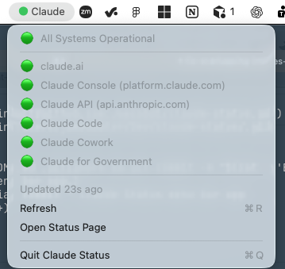
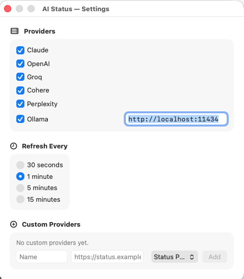

# AI Status

macOS menu bar app that polls the status pages of major AI providers and shows a health indicator at a glance.



## Providers

| Provider | Status Page |
|---|---|
| Claude | status.claude.com |
| OpenAI | status.openai.com |
| Groq | groqstatus.com |
| Cohere | status.cohere.com |
| Perplexity | status.perplexity.com |
| Ollama | localhost:11434 (auto-detected) |

## Status Indicator

The menu bar dot reflects the worst status across all cloud providers:

- 🟢 All Systems Operational
- 🟡 Degraded Performance
- 🟠 Partial Outage
- 🔴 Major Outage
- ⚪️ Unknown / loading
- ⚫️ Not running (Ollama only — does not affect the overall dot)

Click any provider to see per-component status and active incidents.

## Settings

Open via **Settings…** in the menu or press **⌘,**.



- **Providers** — toggle each provider on/off; configure the Ollama URL inline
- **Refresh Every** — 30 seconds, 1 minute, 5 minutes, or 15 minutes
- **Custom Providers** — add any Statuspage-compatible or Ollama endpoint by name and URL

All settings persist across restarts.

## Adding a Custom Provider

Any service using [Statuspage](https://www.atlassian.com/software/statuspage) or [Instatus](https://instatus.com) works — just enter the base URL (e.g. `https://status.example.com`) and the app appends `/api/v2/summary.json` automatically. For a local Ollama instance on a custom port, choose the **Ollama** type and enter the full URL.

## Requirements

- macOS 13+
- Xcode Command Line Tools — `xcode-select --install`

## Build & Run

```bash
./build.sh
open build/AIStatus.app
```

## Install

```bash
cp -r build/AIStatus.app ~/Applications/
```

To auto-start at login: **System Settings → General → Login Items → +** → select `AIStatus.app`.
